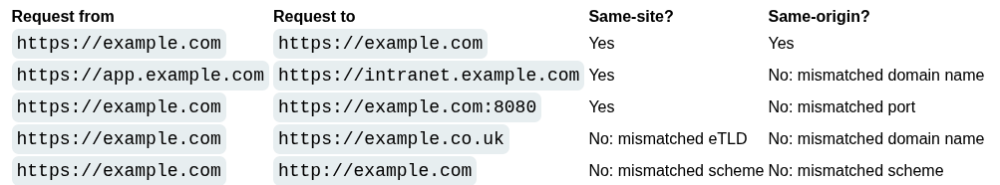

# Bypassing SameSite cookie restrictions

SameSite protects against CSRF, cross-site leaks, and some CORS exploits.

Chrome has Lax SameSite if website doesn't set it.

SameSite is TLD+1 and scheme (ex. http://something.com, TLD is .com, +1 is something, scheme http)

Origin is the whole URL (whole domain + port)

# Restriction levels

- Strict: will not send cookies in any cross-site requests
- Lax:  cookie is only sent in cross-site requests that meet specific criteria (if it's a GET and request results from top-level navigation of user such as click link, not included in background requests like scripts, iframes or references to images or resources)
- None: disable SameSite, sending cookies in all requests. Most browsers do this by default, except chrome. Ex. tracking cookies or no sensitive data/functionality.

When setting a cookie with SameSite=None, the website must also include the Secure attribute, which ensures that the cookie is only sent in encrypted messages over HTTPS. Otherwise, browsers will reject the cookie and it won't be set.

Set-Cookie: session=0F8tgdOhi9ynR1M9wa3ODa; `SameSite=Strict`

## Bypassing SameSite Lax restrictions using GET requests
~~~~~~~~~~~~~~~~~~~~~~~~~~~~~~~~~

~~~~~~~~~~~~~~~~~~~~~~~~~~~~~~~~~

Symphony framework allows method parameter in forms:

~~~~~~~~~~~~~~~~~~~~~~~~~~~~~~~~~
<form action="https://vulnerable-website.com/account/transfer-payment" method="POST">
    <input type="hidden" name="_method" value="GET">
    <input type="hidden" name="recipient" value="hacker">
    <input type="hidden" name="amount" value="1000000">
</form>
~~~~~~~~~~~~~~~~~~~~~~~~~~~~~~~~~

### Example:
~~~~~~~~~~~~~~~~~~~~~~~~~~~~~~~~~

~~~~~~~~~~~~~~~~~~~~~~~~~~~~~~~~~

## Bypassing SameSite restrictions using on-site gadgets

`SameSite=Strict`
 
If can a gadget that results in a secondary request within the same site

A gadget could be a client-side redirect that dynamically constructs the redirection target using attacker-controllable input like URL parameters

For browser client-side redirects are not redirects, are treated as a standalone request including cookies since would be same-site

It is not the same for server-side redirects, browser recognize it and restrict

### Example:

/my-account/change-email -> no unpredictable tokens

Cookies -> SameSite=Strict

Redirection found at /post/comment/confirmation?postId=1/../../my-account

~~~~~~~~~~~~~~~~~~~~~~~~~~~~~~~~~

~~~~~~~~~~~~~~~~~~~~~~~~~~~~~~~~~

## Bypassing SameSite restrictions via vulnerable sibling domains

yourcompany.net

yourcompany.com

XSS, can compromise site-based defenses completely, exposing all of the site's domains to cross-site attacks.

if the target website supports WebSockets, this functionality might be vulnerable to cross-site WebSocket hijacking (CSWSH). CSRF attack targeting a WebSocket handshake.

CSWSH (cross-site WebSocket hijacking)

### Example:

websockets

→ Ready

Server answers all chat history
~~~~~~~~~~~~~~~~~~~~~~~~~~~~~~~~~

~~~~~~~~~~~~~~~~~~~~~~~~~~~~~~~~~
In burp:

`https://cms-0a100030041bd80e80fbd53900870002.web-security-academy.net/login`

Login has XSS in Username

Change request method

Can use this XSS to launch the CSWSH attack without it being mitigated by SameSite restrictions.

~~~~~~~~~~~~~~~~~~~~~~~~~~~~~~~~~

~~~~~~~~~~~~~~~~~~~~~~~~~~~~~~~~~

## Bypassing SameSite Lax restrictions with newly issued cookies

SameSite Lax does not send cookies normally, there are exceptions

To avoid breaking SSO, it doesn't apply this restrictions the first 120 seconds, in which succeptible to cross-site attacks

It's hard to make it on the 2 min so the victim falls, but if can find a gadget that enables to force a new cookie...

For example, completing OAuth login may result in new session each time, since the OAuth service doesn't know if user is still logged

To trigger the cookie refresh without the victim havint to login again, need top-level navigation, to ensure cookies of OAuth are included. It's an issue cause then need to redirect user back to our site to launch CSRF attack.

Alternative, trigger cookie refresh from a new  tab so the browser doesn't leave the page before delivering final attack. Problem is that browsers block popup tabs unless the're opened manually. 

blocked by default:

`window.open('https://vulnerable-website.com/login/sso');`

to get around, can wrap in an onclick:
~~~~~~~~~~~~~~~~~~~~~~~~~~~~~~~~~
window.onclick = () => {
    window.open('https://vulnerable-website.com/login/sso');
}
~~~~~~~~~~~~~~~~~~~~~~~~~~~~~~~~~
### Example:

Cookies do not specify SameSite -> Chrome puts Lax

This CSRF redirects to login because 120 seconds already passed, if done in less than 120 seconds, then it works even if it is a POST:
~~~~~~~~~~~~~~~~~~~~~~~~~~~~~~~~~

<form action="https://YOUR-LAB-ID.web-security-academy.net/my-account/change-email" method="POST">
    <input type="hidden" name="email" value="foo@bar.com" />
    <input type="submit" value="Submit request" />
</form>

~~~~~~~~~~~~~~~~~~~~~~~~~~~~~~~~~
## Bypassing SameSite restrictions

Make victim refresh on /social-login, then CRSF to change email. Works also if it's less than 2 min since cookie was set. If not, the attack fails because the popup blocker prevents the forced cookie refresh.
~~~~~~~~~~~~~~~~~~~~~~~~~~~~~~~~~
<form method="POST" action="https://0a12003f04fc9509823ce32300380029.web-security-academy.net/my-account/change-email">
    <input type="hidden" name="email" value="pwned@web-security-academy.net">
</form>

~~~~~~~~~~~~~~~~~~~~~~~~~~~~~~~~~

Bypass popup blocker

Induces victim to click on page and only opens popup once user has clicked
~~~~~~~~~~~~~~~~~~~~~~~~~~~~~~~~~
<form method="POST" action="https://YOUR-LAB-ID.web-security-academy.net/my-account/change-email">
    <input type="hidden" name="email" value="pwned@portswigger.net">
</form>

Click anywhere on the page

~~~~~~~~~~~~~~~~~~~~~~~~~~~~~~~~~
